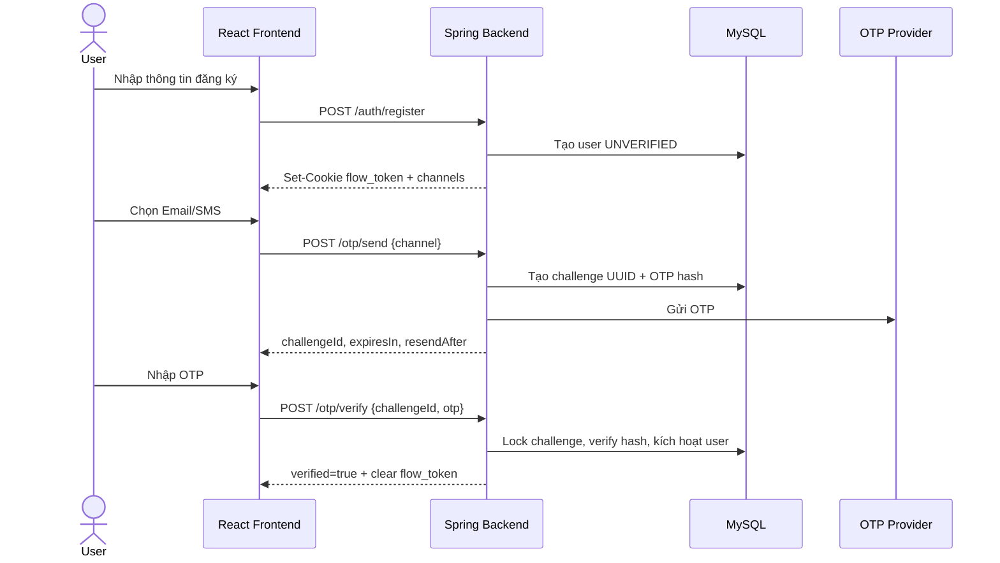
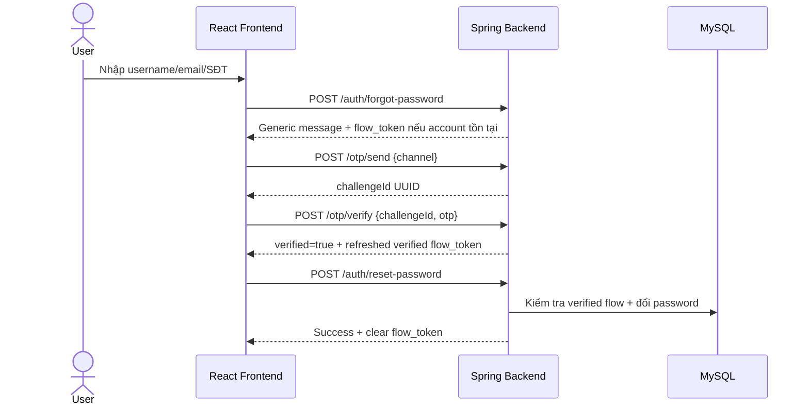

# OTP Web Demo

Ứng dụng web minh họa quy trình đăng ký, xác thực tài khoản bằng OTP, đăng nhập bằng JWT và khôi phục mật khẩu. Dự án tập trung vào việc tách biệt OTP flow trước đăng nhập với phiên đăng nhập chính, đồng thời hạn chế lộ dữ liệu định danh qua API.

## Chức năng chính

- Đăng ký tài khoản bằng username, mật khẩu, email và số điện thoại.
- Xác thực tài khoản bằng OTP.
- Đăng nhập và duy trì phiên bằng JWT trong `HttpOnly Cookie`.
- Đăng xuất và xóa cookie phiên.
- Quên mật khẩu, xác thực OTP và đặt lại mật khẩu.
- Gửi OTP qua Email SMTP.
- Demo SMS bằng eSMS Sandbox hoặc in OTP ra terminal trong chế độ development.
- Chuẩn bị adapter cho Zalo; provider gửi thật hiện chưa được bật.
- Rate limit theo user và IP, thời gian chờ resend, giới hạn số lần nhập sai.
- Flyway quản lý phiên bản database.

## Công nghệ

| Thành phần | Công nghệ |
|---|---|
| Backend | Java 21, Spring Boot 4, Spring MVC |
| Security | Spring Security, JWT, HMAC-signed flow token |
| Persistence | Spring Data JPA, Hibernate |
| Database | MySQL |
| Migration | Flyway |
| Email | Spring Mail / SMTP |
| Frontend | React 19, React Router, Vite |
| API docs | springdoc-openapi, Swagger UI |

## Kiến trúc tổng quan

```text
Browser / React
      │
      │ HTTPS + JSON + HttpOnly cookies
      ▼
Spring MVC Controllers
      │
      ├── AuthController
      └── OtpController
      │
      ▼
Application Services
      │
      ├── AuthService
      ├── OtpService
      └── OtpChannelAvailabilityService
      │
      ├──────────────┐
      ▼              ▼
Repositories      OTP Sender Router
      │              │
      ▼              ├── Email SMTP
    MySQL             ├── eSMS Sandbox
                      └── Zalo adapter
```

Backend sử dụng kiến trúc phân lớp:

- `controller`: nhận request, đọc cookie, validate DTO và trả response.
- `service`: chứa nghiệp vụ đăng ký, đăng nhập, OTP và reset mật khẩu.
- `repository`: truy cập MySQL thông qua Spring Data JPA.
- `entity`: ánh xạ bảng `users` và `otp_log`.
- `security`: JWT filter và flow token service.
- `service/sender`: adapter gửi OTP theo từng kênh.
- `dto`: định nghĩa contract request/response, không trả trực tiếp entity.
- `exception`: mã lỗi nghiệp vụ và global exception handler.

Frontend tổ chức theo:

- `pages`: các màn hình đăng ký, đăng nhập, OTP và reset mật khẩu.
- `context/AuthContext.jsx`: quản lý state và điều phối auth/OTP flow.
- `utils/api.js`: HTTP client dùng chung, luôn gửi cookie với `credentials: include`.
- `layouts` và `components`: bố cục và thành phần giao diện dùng lại.

## Hai loại phiên bảo mật

### Access token

Sau khi đăng nhập thành công, backend tạo JWT và ghi vào cookie:

```http
Set-Cookie: access_token=<jwt>; HttpOnly; SameSite=Lax; Path=/
```

JWT không xuất hiện trong JSON response và không được lưu trong `localStorage`. `JwtAuthenticationFilter` đọc JWT từ cookie hoặc Bearer header. Bearer header vẫn được hỗ trợ để thử API bằng công cụ bên ngoài.

### Flow token

Các thao tác đăng ký, xác thực tài khoản và quên mật khẩu xảy ra trước khi người dùng có JWT. Backend dùng một token HMAC riêng trong cookie:

```http
Set-Cookie: flow_token=<signed-token>; HttpOnly; SameSite=Lax; Path=/api
```

Flow token chứa thông tin đã ký:

```text
userId | purpose | expiresAt | verified
```

Client không được gửi `userId` khi thao tác OTP. Backend lấy user và mục đích OTP từ flow cookie. Mặc định flow cookie hết hạn sau 15 phút.

## Luồng đăng ký và xác thực



## Luồng quên mật khẩu



## API contract

Base URL mặc định:

```text
http://localhost:8080/api/v1
```

Success response dùng format flat, không có lớp `data`:

```json
{
  "code": "SUCCESS",
  "message": "OTP đã được gửi",
  "traceId": "fc55a2c7-b776-4ba7-aecc-192d9b8b77b7",
  "challengeId": "ddc65e4e-3de7-483e-8a4a-a21ad1e38ebe",
  "channel": "SMS",
  "destination": "******1918",
  "expiresIn": 300,
  "resendAfter": 60
}
```

Error response không chứa stack trace, internal ID hoặc dữ liệu nhạy cảm:

```json
{
  "code": "OTP-4001",
  "message": "Mã OTP không chính xác",
  "traceId": "13ba877f-b2a9-4bfa-81f5-579fecf248c6"
}
```

### Authentication API

#### `POST /auth/register`

Tạo tài khoản và thiết lập flow cookie `VERIFY_ACCOUNT`.

Request:

```json
{
  "username": "demo_user",
  "password": "Password@123",
  "fullName": "Demo User",
  "email": "demo@example.com",
  "phone": "0912345678"
}
```

Response `201 Created` trả username, trạng thái, địa chỉ đã mask và các kênh OTP. Response không trả `userId`.

#### `POST /auth/login`

Request:

```json
{
  "username": "demo_user",
  "password": "Password@123"
}
```

Khi thành công, backend ghi JWT vào `access_token` HttpOnly cookie và trả thông tin hiển thị của user. Nếu tài khoản chưa xác thực, backend trả `USR-4031`, danh sách channels và thiết lập flow cookie để tiếp tục xác thực.

#### `POST /auth/logout`

Xóa cả `access_token` và `flow_token`.

#### `POST /auth/forgot-password`

Request:

```json
{
  "identifier": "demo_user"
}
```

`identifier` có thể là username, email hoặc số điện thoại. Endpoint luôn trả thông báo chung để hạn chế account enumeration:

```text
Nếu tài khoản tồn tại, bạn sẽ nhận được hướng dẫn
```

Nếu tìm thấy account, backend thiết lập flow cookie `RESET_PASSWORD` và trả các kênh đã mask.

#### `POST /auth/reset-password`

Yêu cầu flow cookie có purpose `RESET_PASSWORD` và trạng thái `verified=true`.

```json
{
  "newPassword": "NewPassword@123",
  "confirmPassword": "NewPassword@123"
}
```

Request không chứa `userId` hoặc reset token.

### OTP API

Tất cả OTP endpoint yêu cầu `flow_token` hợp lệ.

#### `POST /otp/channels`

Không cần body. Backend lấy user và purpose từ flow cookie, sau đó trả danh sách kênh cùng trạng thái khả dụng.

#### `POST /otp/send`

```json
{
  "channel": "SMS"
}
```

Giá trị channel: `EMAIL`, `SMS`, `ZALO`. Response trả `challengeId` UUID, không trả ID database.

#### `POST /otp/verify`

```json
{
  "challengeId": "ddc65e4e-3de7-483e-8a4a-a21ad1e38ebe",
  "otp": "123456"
}
```

Backend kiểm tra challenge thuộc đúng user và purpose trong flow cookie, lock bản ghi để OTP chỉ được dùng một lần, kiểm tra hạn sử dụng và số lần nhập sai.

#### `POST /otp/resend`

```json
{
  "challengeId": "ddc65e4e-3de7-483e-8a4a-a21ad1e38ebe"
}
```

OTP cũ bị vô hiệu hóa và backend tạo challenge mới sau khi hết cooldown.

## Kênh gửi OTP

| Kênh | Trạng thái | Ghi chú |
|---|---|---|
| Email | Hoạt động khi SMTP được cấu hình | Gửi OTP thật tới email đăng ký |
| SMS | eSMS Sandbox / local preview | Sandbox không gửi SMS thật |
| Zalo | Adapter đã chuẩn bị | Cần OA, access token, template và provider thật |

Khi phát triển local:

```env
OTP_DEV_PREVIEW=true
ESMS_SANDBOX=true
```

Nếu SMS provider chưa gửi được, backend vẫn giữ challenge và in OTP trong terminal với prefix `[DEV ONLY]`. Chỉ bật chế độ này khi phát triển; không bật trong production vì OTP sẽ xuất hiện trong log.

## Database

### `users`

Lưu username, password hash, thông tin liên hệ và trạng thái:

- `UNVERIFIED`: chưa xác thực OTP.
- `ACTIVE`: đã xác thực và được phép đăng nhập.
- `LOCKED`: tài khoản bị khóa.

### `otp_log`

Lưu OTP hash, purpose, channel, trạng thái, số lần thử và thời gian hết hạn. API sử dụng `challenge_id` UUID thay cho khóa chính tuần tự.

Các trạng thái OTP:

- `PENDING`
- `VERIFIED`
- `EXPIRED`
- `INVALIDATED`
- `BLOCKED`

Flyway tự chạy các migration trong `backend/src/main/resources/db/migration`. V2 và V3 là lịch sử thêm rồi loại bỏ Telegram; hệ thống hiện không hỗ trợ Telegram.

## Cơ chế bảo mật

- Password được hash bằng BCrypt, không lưu plain text.
- OTP được sinh bằng nguồn ngẫu nhiên an toàn và chỉ lưu HMAC hash.
- So sánh OTP hash theo constant-time.
- JWT và flow token nằm trong HttpOnly cookie.
- Flow token dùng secret riêng với JWT và OTP HMAC.
- Client không truyền `userId` trong OTP flow.
- Challenge công khai là UUID, không phải ID database tuần tự.
- Challenge được bind với user và purpose trong cookie.
- Pessimistic lock bảo vệ verify/reset khỏi concurrent request.
- OTP có TTL, resend cooldown, giới hạn số lần nhập và rate limit.
- Email và số điện thoại trong response được mask.
- Forgot password dùng thông báo chung để hạn chế dò account.
- Global error handler không trả stack trace hay exception nội bộ.
- CORS chỉ cho phép frontend local đã cấu hình và hỗ trợ cookie credentials.

Trong production phải dùng HTTPS và đặt:

```env
COOKIE_SECURE=true
OTP_DEV_PREVIEW=false
```

## Cài đặt môi trường

Yêu cầu:

- Java 21 trở lên.
- Node.js 20 trở lên và npm.
- MySQL đang chạy.

Tạo database:

```sql
CREATE DATABASE otp_demo
  CHARACTER SET utf8mb4
  COLLATE utf8mb4_unicode_ci;
```

## Chạy dự án

### Backend

PowerShell:

```powershell
cd backend
.\mvnw.cmd spring-boot:run
```

Backend mặc định chạy tại:

```text
http://localhost:8080
```

### Frontend

Mở terminal khác:

```powershell
cd frontend
npm install
npm run dev
```

Frontend mặc định chạy tại:

```text
http://localhost:5173
```

Nếu backend không chạy ở cổng mặc định, tạo `frontend/.env`:

```env
VITE_API_URL=http://localhost:8080/api/v1
```


## Demo end-to-end

### Xác thực tài khoản

1. Mở frontend và đăng ký tài khoản.
2. Chọn Email hoặc SMS Sandbox.
3. FE chuyển ngay sang màn nhập mã trong khi backend gửi OTP.
4. Với Email, lấy mã trong hộp thư.
5. Với SMS local preview, lấy mã từ terminal backend.
6. Nhập OTP để kích hoạt tài khoản.
7. Đăng nhập; JWT được lưu tự động trong HttpOnly cookie.

### Quên mật khẩu

1. Chọn “Quên mật khẩu”.
2. Nhập username, email hoặc số điện thoại.
3. Chọn kênh OTP.
4. Nhập OTP.
5. Đặt mật khẩu mới.
6. Đăng nhập lại bằng mật khẩu mới.

## Build và kiểm tra tĩnh

Backend:

```powershell
cd backend
.\mvnw.cmd -DskipTests package
```

Frontend:

```powershell
cd frontend
npm run lint
npm run build
```

## Cấu trúc thư mục

```text
Web-demo/
├── backend/
│   ├── src/main/java/com/example/otpdemo/
│   │   ├── config/
│   │   ├── controller/
│   │   ├── dto/
│   │   ├── entity/
│   │   ├── enums/
│   │   ├── exception/
│   │   ├── repository/
│   │   ├── security/
│   │   ├── service/
│   │   └── util/
│   └── src/main/resources/
│       ├── application.yaml
│       └── db/migration/
├── frontend/
│   └── src/
│       ├── components/
│       ├── context/
│       ├── layouts/
│       ├── pages/
│       └── utils/
└── docs/
    ├── OTP_Project_Plan.md
    └── implementation_plan.md
```

## Tài liệu liên quan

- `docs/OTP_Project_Plan.md`: kế hoạch và quy ước ban đầu của dự án.
- `docs/implementation_plan.md`: kế hoạch redesign auth/OTP contract và flow cookie.
