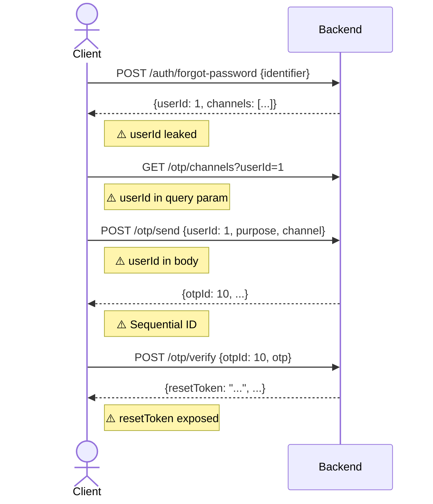
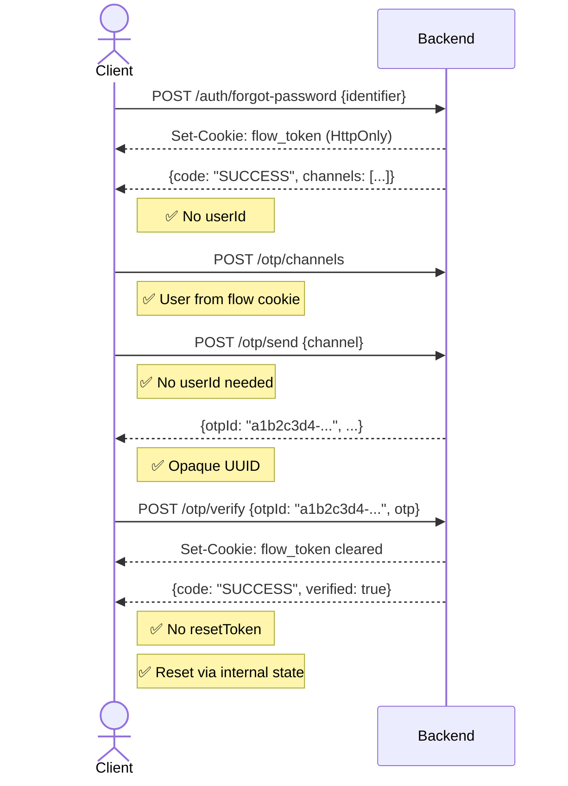

# Secure Auth & OTP API Contract Redesign

Redesign toàn bộ authentication & OTP flow để khắc phục các lỗ hổng bảo mật: loại bỏ userId khỏi client request, sử dụng opaque OTP challenge ID, bind OTP flow bằng HttpOnly flow cookie, thống nhất response format, và chống account enumeration.

---

## User Review Required

> [!IMPORTANT]
> Đây là **breaking change** cho cả backend lẫn frontend. Sau khi triển khai, tất cả API contract cũ sẽ không còn tương thích. Cần deploy đồng thời cả 2 phía.

> [!WARNING]
> Database migration mới sẽ thêm cột `challenge_id` (UUID) vào bảng `otp_log`. Cần chạy Flyway migration trước khi deploy backend mới.

> [!CAUTION]
> Flow cookie sử dụng HMAC-signed token riêng (không phải JWT chính). Nếu `app.flow-secret` bị lộ, attacker có thể tự tạo flow cookie. Cần đảm bảo biến môi trường an toàn.

---

## Open Questions

> [!IMPORTANT]
> 1. **Flow cookie TTL**: Đề xuất 15 phút cho flow cookie (đủ thời gian hoàn thành OTP). Bạn muốn thay đổi không?
> 2. **Forgot password generic message**: Khi identifier không tìm thấy, vẫn trả `"Nếu tài khoản tồn tại, bạn sẽ nhận được hướng dẫn"` – chấp nhận trải nghiệm này?
> 3. **Login response**: Chuyển login sang dùng `ApiResponse` wrapper giống các API khác, hay giữ format flat như bạn đề xuất?

---

## Architecture Overview

### Current Flow (Insecure)


### New Flow (Secure)


---

## Proposed Changes

### Backend — Database Migration

#### [NEW] [V4__add_challenge_id.sql](file:///d:/AnhTran/PTIT/NAM4-Ki1/ATW/BTL/Web-demo/backend/src/main/resources/db/migration/V4__add_challenge_id.sql)

Thêm cột `challenge_id` (CHAR(36) UUID) vào bảng `otp_log` để thay thế sequential `id` trong API responses.

```sql
ALTER TABLE otp_log ADD COLUMN challenge_id CHAR(36) NOT NULL DEFAULT '' AFTER id;
UPDATE otp_log SET challenge_id = UUID() WHERE challenge_id = '';
ALTER TABLE otp_log ADD UNIQUE INDEX idx_otp_challenge_id (challenge_id);
```

---

### Backend — Flow Cookie Service

#### [NEW] [FlowTokenService.java](file:///d:/AnhTran/PTIT/NAM4-Ki1/ATW/BTL/Web-demo/backend/src/main/java/com/example/otpdemo/security/FlowTokenService.java)

Service tạo và validate HMAC-signed flow token chứa `userId|purpose|expiresAt`. Dùng secret riêng (`app.flow-secret`) khác với JWT secret.

- `createToken(userId, purpose)` → signed string, TTL 15 phút
- `parseToken(token)` → `FlowClaims { userId, purpose }`
- `buildCookie(token)` → `ResponseCookie` (HttpOnly, SameSite=Lax, Path=/api, maxAge=900)
- `clearCookie()` → `ResponseCookie` (maxAge=0)

---

### Backend — Entity Changes

#### [MODIFY] [OtpLog.java](file:///d:/AnhTran/PTIT/NAM4-Ki1/ATW/BTL/Web-demo/backend/src/main/java/com/example/otpdemo/entity/OtpLog.java)

- Thêm field `challengeId` (String, UUID) với `@Column(name = "challenge_id", nullable = false, unique = true)`
- Tự động generate UUID trong `@PrePersist`

---

### Backend — Repository Changes

#### [MODIFY] [OtpLogRepository.java](file:///d:/AnhTran/PTIT/NAM4-Ki1/ATW/BTL/Web-demo/backend/src/main/java/com/example/otpdemo/repository/OtpLogRepository.java)

- Thêm `findByChallengeIdForUpdate(String challengeId)` với `@Lock(PESSIMISTIC_WRITE)`
- Thay thế tất cả lookup bằng `id` (Long) sang `challengeId` (String) trong OTP verify/resend

---

### Backend — DTO Refactor

#### [DELETE] Các DTO request cũ chứa userId:
- [SendOtpRequest.java](file:///d:/AnhTran/PTIT/NAM4-Ki1/ATW/BTL/Web-demo/backend/src/main/java/com/example/otpdemo/dto/request/SendOtpRequest.java) — xóa field `userId`
- [ResendOtpRequest.java](file:///d:/AnhTran/PTIT/NAM4-Ki1/ATW/BTL/Web-demo/backend/src/main/java/com/example/otpdemo/dto/request/ResendOtpRequest.java) — `otpId` đổi sang `String challengeId`
- [VerifyOtpRequest.java](file:///d:/AnhTran/PTIT/NAM4-Ki1/ATW/BTL/Web-demo/backend/src/main/java/com/example/otpdemo/dto/request/VerifyOtpRequest.java) — `otpId` đổi sang `String challengeId`
- [ResetPasswordRequest.java](file:///d:/AnhTran/PTIT/NAM4-Ki1/ATW/BTL/Web-demo/backend/src/main/java/com/example/otpdemo/dto/request/ResetPasswordRequest.java) — xóa field `resetToken`

#### [MODIFY] Response DTOs:
- [ForgotPasswordResponse.java](file:///d:/AnhTran/PTIT/NAM4-Ki1/ATW/BTL/Web-demo/backend/src/main/java/com/example/otpdemo/dto/response/ForgotPasswordResponse.java) — xóa `userId`, chỉ giữ `channels`
- [SendOtpResponse.java](file:///d:/AnhTran/PTIT/NAM4-Ki1/ATW/BTL/Web-demo/backend/src/main/java/com/example/otpdemo/dto/response/SendOtpResponse.java) — `otpId` đổi sang `String` (UUID)
- [VerifyOtpResponse.java](file:///d:/AnhTran/PTIT/NAM4-Ki1/ATW/BTL/Web-demo/backend/src/main/java/com/example/otpdemo/dto/response/VerifyOtpResponse.java) — xóa `resetToken`
- [LoginResponse.java](file:///d:/AnhTran/PTIT/NAM4-Ki1/ATW/BTL/Web-demo/backend/src/main/java/com/example/otpdemo/dto/response/LoginResponse.java) — xóa `userId`, thống nhất dùng `ApiResponse` wrapper
- [RegisterResponse.java](file:///d:/AnhTran/PTIT/NAM4-Ki1/ATW/BTL/Web-demo/backend/src/main/java/com/example/otpdemo/dto/response/RegisterResponse.java) — xóa `userId`

---

### Backend — Controller Refactor

#### [MODIFY] [AuthController.java](file:///d:/AnhTran/PTIT/NAM4-Ki1/ATW/BTL/Web-demo/backend/src/main/java/com/example/otpdemo/controller/AuthController.java)

| Endpoint | Thay đổi |
|---|---|
| `POST /login` | Wrap response trong `ApiResponse`. Xóa `userId` khỏi response body. |
| `POST /register` | Set flow cookie (userId + VERIFY_ACCOUNT). Xóa `userId` khỏi response. Trả luôn channels trong response. |
| `POST /forgot-password` | Set flow cookie (userId + RESET_PASSWORD). Xóa `userId` khỏi response. Generic message khi user không tồn tại (chống enumeration). Trả luôn channels. |
| `POST /reset-password` | Đọc userId từ flow cookie thay vì resetToken. Validate OTP đã verified cho user đó. Clear flow cookie. |

#### [MODIFY] [OtpController.java](file:///d:/AnhTran/PTIT/NAM4-Ki1/ATW/BTL/Web-demo/backend/src/main/java/com/example/otpdemo/controller/OtpController.java)

| Endpoint | Thay đổi |
|---|---|
| `GET /channels?userId=X` → `POST /channels` | Đọc userId & purpose từ flow cookie. Xóa query params. |
| `POST /send` | Xóa `userId` & `purpose` khỏi request body. Đọc từ flow cookie. Body chỉ cần `{ channel }`. |
| `POST /verify` | Đổi `otpId` (Long) → `challengeId` (String UUID). Không trả `resetToken`. Set flow cookie mới cho reset step. |
| `POST /resend` | Đổi `otpId` (Long) → `challengeId` (String UUID). |

---

### Backend — Service Refactor

#### [MODIFY] [AuthService.java](file:///d:/AnhTran/PTIT/NAM4-Ki1/ATW/BTL/Web-demo/backend/src/main/java/com/example/otpdemo/service/AuthService.java)

- `forgotPassword()`: Trả generic message dù user có tồn tại hay không. Nếu tồn tại → set flow cookie + trả channels. Nếu không → trả cùng response format nhưng channels rỗng (hoặc fake delay).
- `register()`: Kèm channels list trong response để FE không cần gọi riêng `/otp/channels`.
- `resetPassword()`: Nhận userId từ flow cookie, không nhận resetToken. Tìm OTP log mới nhất của user có status=VERIFIED và purpose=RESET_PASSWORD.
- `login()`: Error cho unverified account không trả userId. Set flow cookie + trả channels luôn.

#### [MODIFY] [OtpService.java](file:///d:/AnhTran/PTIT/NAM4-Ki1/ATW/BTL/Web-demo/backend/src/main/java/com/example/otpdemo/service/OtpService.java)

- `sendOtp()`: Bỏ param `userId`, nhận từ caller (controller đọc flow cookie).
- `verifyOtp()`: Lookup bằng `challengeId` thay vì `id`. Validate challengeId thuộc về userId trong flow cookie.
- `resendOtp()`: Lookup bằng `challengeId`. Validate ownership.
- Generate `challengeId = UUID.randomUUID().toString()` khi tạo OtpLog mới.

#### [MODIFY] [OtpChannelAvailabilityService.java](file:///d:/AnhTran/PTIT/NAM4-Ki1/ATW/BTL/Web-demo/backend/src/main/java/com/example/otpdemo/service/OtpChannelAvailabilityService.java)

- Bỏ tham số `userId`, nhận `User` entity trực tiếp từ caller.

---

### Backend — Security Config

#### [MODIFY] [SecurityConfig.java](file:///d:/AnhTran/PTIT/NAM4-Ki1/ATW/BTL/Web-demo/backend/src/main/java/com/example/otpdemo/config/SecurityConfig.java)

- Không thay đổi lớn, OTP endpoints vẫn public (flow cookie validate ở controller/service level, không qua Spring Security filter).

#### [MODIFY] [JwtAuthenticationFilter.java](file:///d:/AnhTran/PTIT/NAM4-Ki1/ATW/BTL/Web-demo/backend/src/main/java/com/example/otpdemo/security/JwtAuthenticationFilter.java)

- Không thay đổi. Flow cookie xử lý riêng, không liên quan JWT auth.

---

### Backend — Error Handling

#### [MODIFY] [ErrorCode.java](file:///d:/AnhTran/PTIT/NAM4-Ki1/ATW/BTL/Web-demo/backend/src/main/java/com/example/otpdemo/exception/ErrorCode.java)

Thêm error codes mới:
- `FLOW_EXPIRED` / `FLOW-4011`: "Phiên xác thực đã hết hạn. Vui lòng thử lại."
- `FLOW_INVALID` / `FLOW-4012`: "Phiên không hợp lệ."
- `OTP_OWNERSHIP` / `OTP-4031`: "Không có quyền truy cập OTP này."

#### [MODIFY] [GlobalExceptionHandler.java](file:///d:/AnhTran/PTIT/NAM4-Ki1/ATW/BTL/Web-demo/backend/src/main/java/com/example/otpdemo/exception/GlobalExceptionHandler.java)

- Đảm bảo tất cả error response đều có format: `{ code, message, traceId }` — không có `data`, `stack`, hay thông tin nhạy cảm.

---

### Backend — application.yaml

#### [MODIFY] [application.yaml](file:///d:/AnhTran/PTIT/NAM4-Ki1/ATW/BTL/Web-demo/backend/src/main/resources/application.yaml)

Thêm config:
```yaml
app:
  flow-secret: ${FLOW_SECRET:defaultFlowSecretMinimum32Characters!!}
  flow-ttl-seconds: ${FLOW_TTL:900}
```

#### [MODIFY] [.env](file:///d:/AnhTran/PTIT/NAM4-Ki1/ATW/BTL/Web-demo/backend/.env)

Thêm: `FLOW_SECRET=yourFlowSecretKeyAtLeast32CharsLong`

---

### Frontend — API & Auth Context

#### [MODIFY] [api.js](file:///d:/AnhTran/PTIT/NAM4-Ki1/ATW/BTL/Web-demo/frontend/src/utils/api.js)

- Không thay đổi lớn. `credentials: 'include'` đã hỗ trợ gửi/nhận cookie tự động.

#### [MODIFY] [AuthContext.jsx](file:///d:/AnhTran/PTIT/NAM4-Ki1/ATW/BTL/Web-demo/frontend/src/context/AuthContext.jsx)

Đây là file thay đổi lớn nhất phía FE:

| Function | Thay đổi |
|---|---|
| `login()` | Response nằm trong `result.data` (wrapped). Xóa logic đọc `userId` từ error. Khi USR-4031, channels trả kèm trong error response (backend set flow cookie sẵn), navigate thẳng `/verify-method`. |
| `register()` | Channels trả kèm trong register response. Xóa `loadChannels()` call riêng. Xóa `userId` khỏi `recovery` state. |
| `forgotPassword()` | Xóa `loadChannels()` call riêng. Channels & flow cookie trả kèm trong response. |
| `loadChannels()` | Đổi sang `POST /otp/channels` (không truyền userId/purpose). |
| `chooseOtpChannel()` | Body chỉ cần `{ channel }`. Xóa `userId` & `purpose`. |
| `submitOtp()` | Đổi `otpId` → `challengeId` (string). Khi purpose = RESET_PASSWORD, navigate thẳng `/reset-password` (không cần đợi resetToken). |
| `resendOtp()` | Đổi `otpId` → `challengeId`. |
| `resetPassword()` | Xóa `resetToken` khỏi request body. Backend tự validate từ flow cookie. |
| `recovery` state | Xóa `userId` field. Chỉ giữ `{ channels, purpose }`. |

---

### Frontend — Pages

#### [MODIFY] [VerifyMethodPage.jsx](file:///d:/AnhTran/PTIT/NAM4-Ki1/ATW/BTL/Web-demo/frontend/src/pages/VerifyMethodPage.jsx)

- Guard condition: check `!recovery` (không check `recovery.userId` nữa).

#### [MODIFY] [VerifyOtpPage.jsx](file:///d:/AnhTran/PTIT/NAM4-Ki1/ATW/BTL/Web-demo/frontend/src/pages/VerifyOtpPage.jsx)

- Dùng `otpState.challengeId` thay cho `otpState.otpId`.

#### [MODIFY] [ResetPasswordPage.jsx](file:///d:/AnhTran/PTIT/NAM4-Ki1/ATW/BTL/Web-demo/frontend/src/pages/ResetPasswordPage.jsx)

- Guard condition: dùng flag `resetForm.ready` thay vì check `resetForm.resetToken`.
- Request body chỉ gửi `{ newPassword, confirmPassword }` — không gửi `resetToken`.

#### [MODIFY] [RegisterPage.jsx](file:///d:/AnhTran/PTIT/NAM4-Ki1/ATW/BTL/Web-demo/frontend/src/pages/RegisterPage.jsx)

- Không đọc `result.data.userId`.

---

## Response Contract Summary

### Success Response (thống nhất flat, không wrapper `data`):

```json
{
  "code": "SUCCESS",
  "message": "Đăng ký thành công",
  "traceId": "abc-123",
  "username": "user1",
  "status": "UNVERIFIED",
  "channels": [...]
}
```

### Error Response:

```json
{
  "code": "OTP-4001",
  "message": "Mã OTP không chính xác",
  "traceId": "abc-123"
}
```

> [!IMPORTANT]
> Bạn đề xuất response flat (không wrapper `data`). Tuy nhiên, hiện tại `ApiResponse<T>` wrapper đang dùng khắp nơi. Có 2 lựa chọn:
> 
> **Option A**: Giữ `ApiResponse` wrapper nhưng sửa nội dung (xóa userId, resetToken, etc.). Ít thay đổi hơn, nhưng vẫn có nested `data`.
>
> **Option B**: Bỏ wrapper, trả flat response. Breaking lớn hơn nhưng clean đúng như đề xuất.
>
> Bạn muốn chọn option nào?

---

## Verification Plan

### Automated Tests

```bash
# Backend: build & validate
cd backend
mvn clean compile

# Run Flyway migration
mvn flyway:migrate

# Start backend
mvn spring-boot:run
```

### Manual Verification

Test toàn bộ flow bằng browser DevTools:

| Step | Kiểm tra | Expected |
|---|---|---|
| Register | Response không có `userId` | ✅ |
| Register | `Set-Cookie: flow_token` xuất hiện | ✅ |
| Register | Navigate → VerifyMethod hiển thị channels | ✅ |
| Send OTP | Request body chỉ có `{ channel }` | ✅ |
| Send OTP | Response `otpId` là UUID string | ✅ |
| Verify OTP | Request dùng `challengeId` (UUID) | ✅ |
| Verify OTP | Response không có `resetToken` | ✅ |
| Forgot Password | Response không có `userId` | ✅ |
| Forgot Password | User không tồn tại → cùng message | ✅ |
| Reset Password | Request không có `resetToken` | ✅ |
| Login unverified | Error không chứa `userId` | ✅ |
| Login success | Response wrapped trong `ApiResponse` | ✅ |
| Flow cookie | DevTools → Cookie `flow_token` HttpOnly | ✅ |
| Flow cookie expire | Chờ 15 phút → gọi OTP API → lỗi FLOW_EXPIRED | ✅ |
